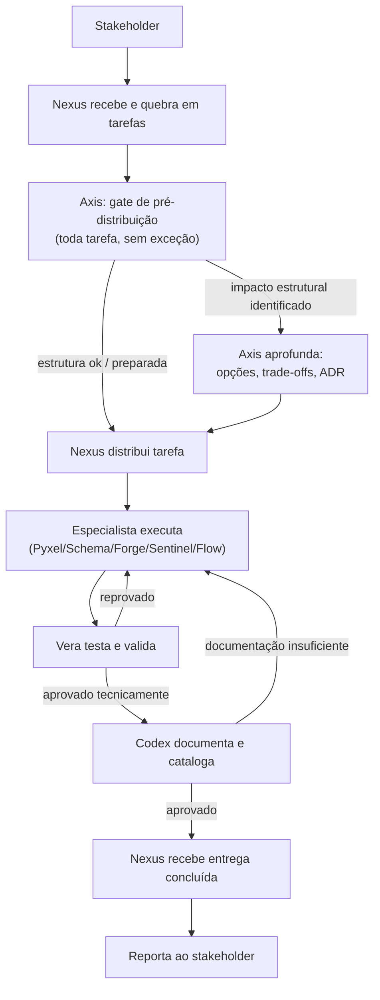

# ARCHITECTURE.md — Time de Agentes de Engenharia de Dados

> Este documento descreve a arquitetura do time multiagente de engenharia de dados: quem são os agentes, como se relacionam, e o fluxo de trabalho do pedido inicial até a entrega documentada e aprovada.

---

## Visão Geral

O time é composto por **9 agentes** organizados em quatro camadas funcionais:

```
┌─────────────────────────────────────────────────────────┐
│  GESTÃO           Nexus (Gestor/Líder Técnico)            │
│  ARQUITETURA      Axis (Arquiteto de Dados)                │
├─────────────────────────────────────────────────────────┤
│  EXECUÇÃO         Pyxel · Schema · Forge · Sentinel · Flow │
├─────────────────────────────────────────────────────────┤
│  QUALIDADE        Vera (QA/Tester)                         │
│  DOCUMENTAÇÃO     Codex (Documentação/Catalogação)          │
└─────────────────────────────────────────────────────────┘
```

Nenhuma tarefa é distribuída sem passar antes pelo **gate de pré-distribuição do Axis** (estrutura de projeto e nomenclatura). Nenhuma entrega é considerada concluída sem passar pelo **duplo gate de saída**: **Vera** (corretude técnica) → **Codex** (documentação/catalogação). Só então retorna ao **Nexus**.

---

## Agentes

| # | Agente | Papel | Camada | Arquivo (`.claude/agents/`) |
|---|---|---|---|---|
| 1 | **Nexus** | Líder Técnico / Gestor de Engenharia de Dados | Gestão | `nexus.md` |
| 2 | **Axis** | Arquiteto de Dados | Arquitetura | `axis.md` |
| 3 | **Pyxel** | Python para Dados | Execução | `pyxel.md` |
| 4 | **Schema** | SQL e Modelagem de Dados | Execução | `schema.md` |
| 5 | **Forge** | Infraestrutura e Cloud | Execução | `forge.md` |
| 6 | **Sentinel** | Qualidade e Governança de Dados | Execução | `sentinel.md` |
| 7 | **Flow** | Orquestração e Pipelines | Execução | `flow.md` |
| 8 | **Vera** | Testadora / QA de Entregas | Qualidade | `vera.md` |
| 9 | **Codex** | Documentação e Catalogação de Dados | Documentação | `codex.md` |

---

## Princípios Arquiteturais

1. **Ponto único de entrada externo** — stakeholders só acionam **Nexus**; nenhum especialista recebe demanda de negócio diretamente.
2. **Separação entre gestão e arquitetura** — Nexus prioriza e aloca; **Axis** garante solidez técnica de longo prazo. Um não substitui o outro.
3. **Colaboração lateral sem burocracia** — especialistas resolvem dependências técnicas entre si sem precisar do Nexus a cada troca, desde que prazo/escopo/custo não mudem.
4. **Qualidade e documentação são gates formais, não etapas opcionais** — toda entrega passa por **Vera** e depois por **Codex** antes de ser considerada concluída.
5. **Ordem importa no duplo gate** — Codex só atua depois que Vera aprova tecnicamente; documentar algo tecnicamente incorreto é retrabalho.
6. **Três estados de conclusão** — "concluído pelo especialista" ≠ "aprovado tecnicamente" ≠ "concluído de fato" (só este último é reportado ao stakeholder).
7. **Reprovação recorrente é sinal de processo** — tanto Vera quanto Codex escalam ao Nexus quando um padrão de erro/lacuna se repete, em vez de tratar caso a caso indefinidamente.
8. **Axis define o padrão de estrutura de projetos (scaffolding); especialistas aplicam** — todo projeto novo (pipeline, modelo dbt, módulo de infraestrutura, DAG) segue um template de pastas/layout mantido pelo Axis.
9. **Axis é gate obrigatório de pré-distribuição, em toda tarefa** — rotineira ou estrutural. Nexus não distribui nada sem essa validação; para a maioria das tarefas o gate é rápido (confirma estrutura já correta), só se aprofunda quando identifica impacto real. Isso não é opcional nem proporcional à complexidade percebida da tarefa.
10. **Convenção de idioma é padrão de todo o time** — identificadores de código (variáveis, funções, tabelas, colunas, recursos de infraestrutura, DAGs) sempre em **inglês**; comentários, docstrings e toda documentação sempre em **português**. Definida por Axis, aplicada por todos os especialistas, verificada por Vera.

---

## Fluxo Padrão de uma Entrega



O gate do Axis (logo após o Nexus) é **obrigatório para toda tarefa**, rotineira ou não. Na maioria dos casos ele apenas confirma que a estrutura de projeto e a convenção de nomenclatura já estão corretas — sem atraso perceptível. Só quando identifica impacto estrutural real é que aprofunda a análise (opções, trade-offs, ADR) antes de liberar a distribuição.

Este fluxo se repete, com variações de entrada, para os quatro cenários documentados no organograma detalhado: **demanda de negócio**, **incidente de dados**, **decisão arquitetural** e **tarefa técnica rotineira**.

---

## Matriz de Acionamento (resumo)

| Situação | Acionar |
|---|---|
| Nova demanda / dúvida de prioridade | Nexus |
| **Toda tarefa antes de distribuir** (estrutura/nomenclatura) | **Axis (gate obrigatório)** |
| Nova arquitetura / mudança de stack | Axis |
| Pipeline/código | Pyxel |
| Modelagem/SQL | Schema |
| Infraestrutura/custo | Forge |
| Qualidade/incidente de dado | Sentinel |
| Orquestração/scheduling | Flow |
| Validar entrega concluída | Vera |
| Documentar/catalogar/consultar o catálogo | Codex |

> Matriz completa e fluxos detalhados (com diagramas por cenário) em `organograma-fluxo-decisao-time-dados.md`.

---

## Documentos Relacionados

- `organograma-fluxo-decisao-time-dados.md` — organograma completo, diagramas Mermaid por cenário, ciclo de qualidade detalhado.
- Arquivos de subagente de cada agente, em `.claude/agents/` (tabela acima) — cabeçalho YAML + system prompt completo de cada papel, prontos para uso no Claude Code.

---

## Como Este Documento Deve Evoluir

- Ao adicionar um novo agente, registrar aqui: papel, camada, e onde ele entra no fluxo padrão.
- Ao mudar uma regra de fluxo (ex.: novo gate, nova ordem), atualizar tanto este resumo quanto o organograma detalhado.
- Revisão recomendada: sempre que o time ganhar um novo papel ou o processo de aprovação mudar.
