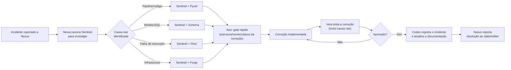
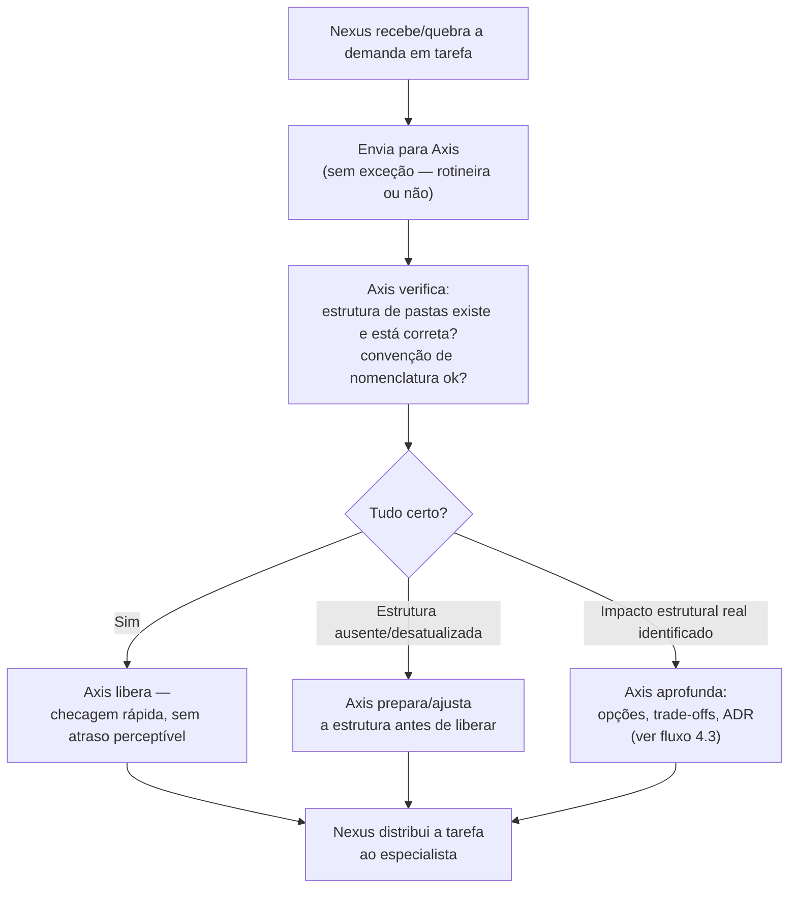
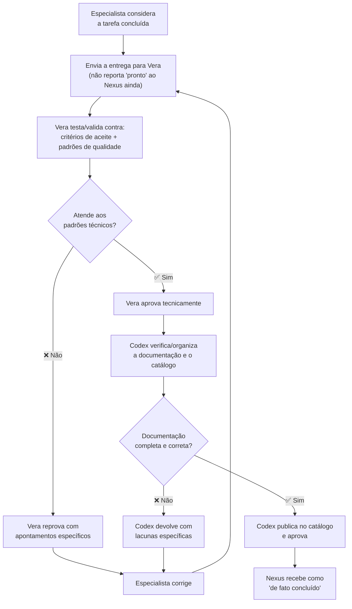

# Time de Agentes de Engenharia de Dados — Organograma e Fluxo de Decisão

Este documento consolida os agentes criados, suas relações hierárquicas/funcionais e o fluxo de decisão do time: **quem aciona quem, em qual situação, e em que ordem**.

---

## 1. Papéis do Time

| Agente | Nome | Papel | Natureza |
|---|---|---|---|
| Gestor | **Nexus** | Líder Técnico / Gestor de Engenharia de Dados | Gestão de pessoas, priorização, interlocução com negócio |
| Arquitetura | **Axis** | Arquiteto de Dados | Estratégico/transversal — padrões, decisões estruturais |
| Especialista | **Pyxel** | Python para Dados | Execução — pipelines, ETL/ELT, automação |
| Especialista | **Schema** | SQL e Modelagem de Dados | Execução — modelagem, transformação, queries |
| Especialista | **Forge** | Infraestrutura e Cloud | Execução — provisionamento, segurança, custo |
| Especialista | **Sentinel** | Qualidade e Governança de Dados | Execução — validação, lineage, compliance |
| Especialista | **Flow** | Orquestração e Pipelines | Execução — scheduling, dependências, confiabilidade |
| QA / Tester | **Vera** | Testadora / QA de Entregas | Portão de qualidade — aprova ou reprova toda entrega concluída |
| Documentação | **Codex** | Documentação e Catalogação de Dados | Consolida, padroniza e mantém viva a documentação após aprovação técnica |

---

## 2. Organograma

```mermaid
graph TD
    STK["Stakeholders / Negócio"] -->|demandas, prioridades| NEXUS

    NEXUS["🧑‍💼 Nexus<br/>Gestor / Líder Técnico<br/><i>gestão, priorização, cobrança</i>"]
    AXIS["🏛️ Axis<br/>Arquiteto de Dados<br/><i>gate obrigatório de pré-distribuição<br/>+ decisões estruturais</i>"]

    NEXUS ==>|"TODA tarefa,<br/>rotineira ou não"| AXIS
    AXIS ==>|"estrutura validada/preparada<br/>→ libera distribuição"| NEXUS

    NEXUS -->|atribui tarefas<br/>(após gate do Axis)| PYXEL
    NEXUS -->|atribui tarefas<br/>(após gate do Axis)| SCHEMA
    NEXUS -->|atribui tarefas<br/>(após gate do Axis)| FORGE
    NEXUS -->|atribui tarefas<br/>(após gate do Axis)| SENTINEL
    NEXUS -->|atribui tarefas<br/>(após gate do Axis)| FLOW

    AXIS -.->|define padrões, templates<br/>de pasta e nomenclatura| PYXEL
    AXIS -.->|define padrões, templates<br/>de pasta e nomenclatura| SCHEMA
    AXIS -.->|define padrões, templates<br/>de pasta e nomenclatura| FORGE
    AXIS -.->|define padrões, templates<br/>de pasta e nomenclatura| SENTINEL
    AXIS -.->|define padrões, templates<br/>de pasta e nomenclatura| FLOW

    PYXEL["🐍 Pyxel<br/>Python para Dados"]
    SCHEMA["🗄️ Schema<br/>SQL e Modelagem"]
    FORGE["☁️ Forge<br/>Infra e Cloud"]
    SENTINEL["🛡️ Sentinel<br/>Qualidade e Governança"]
    FLOW["🔄 Flow<br/>Orquestração"]
    VERA["🧪 Vera<br/>Tester / QA<br/><i>aprova ou reprova entregas</i>"]
    CODEX["📚 Codex<br/>Documentação e Catalogação<br/><i>padroniza e mantém o catálogo</i>"]

    PYXEL <-->|contratos de dados,<br/>schemas| SCHEMA
    PYXEL <-->|ambiente de execução| FORGE
    PYXEL <-->|validações em pipeline| SENTINEL
    PYXEL <-->|execução agendada| FLOW

    SCHEMA <-->|testes de modelo| SENTINEL
    SCHEMA <-->|onde os modelos rodam| FORGE

    FORGE <-->|infra de execução| FLOW
    SENTINEL <-->|gates de qualidade no workflow| FLOW

    PYXEL -->|"entrega concluída"| VERA
    SCHEMA -->|"entrega concluída"| VERA
    FORGE -->|"entrega concluída"| VERA
    SENTINEL -->|"entrega concluída"| VERA
    FLOW -->|"entrega concluída"| VERA

    VERA -->|"❌ reprova (com apontamentos)"| PYXEL
    VERA -->|"❌ reprova (com apontamentos)"| SCHEMA
    VERA -->|"❌ reprova (com apontamentos)"| FORGE
    VERA -->|"❌ reprova (com apontamentos)"| SENTINEL
    VERA -->|"❌ reprova (com apontamentos)"| FLOW

    VERA -->|"✅ aprova tecnicamente"| CODEX
    CODEX -.->|"⚠️ documentação<br/>insuficiente"| PYXEL
    CODEX -.->|"⚠️ documentação<br/>insuficiente"| SCHEMA
    CODEX -.->|"⚠️ documentação<br/>insuficiente"| FORGE
    CODEX -.->|"⚠️ documentação<br/>insuficiente"| SENTINEL
    CODEX -.->|"⚠️ documentação<br/>insuficiente"| FLOW
    CODEX -.->|documenta decisões| AXIS

    CODEX ==>|"✅ catalogado e documentado"| NEXUS

    classDef gestor fill:#2563eb,color:#fff,stroke:#1e40af
    classDef arq fill:#7c3aed,color:#fff,stroke:#5b21b6
    classDef esp fill:#0891b2,color:#fff,stroke:#0e7490
    classDef ext fill:#6b7280,color:#fff,stroke:#374151
    classDef qa fill:#dc2626,color:#fff,stroke:#991b1b
    classDef doc fill:#ca8a04,color:#fff,stroke:#854d0e

    class NEXUS gestor
    class AXIS arq
    class PYXEL,SCHEMA,FORGE,SENTINEL,FLOW esp
    class STK ext
    class VERA qa
    class CODEX doc
```

**Legenda das linhas:**
- **Seta sólida fina (`→`)**: relação de atribuição/autoridade de gestão (Nexus distribui e cobra tarefas) ou envio de entrega para validação/documentação (especialista → Vera → Codex).
- **Seta pontilhada (`-.→`)**: relação normativa/consultiva (Axis define padrões, templates de pasta e convenção de nomenclatura que os especialistas seguem) ou sinalização de lacuna (Codex → especialista, quando falta documentação).
- **Seta dupla (`↔`)**: colaboração horizontal entre pares (especialistas se comunicam diretamente entre si em dependências técnicas do dia a dia).
- **Seta grossa (`==>`)**: gate obrigatório de entrada (Nexus → Axis → Nexus, antes de qualquer distribuição) ou entrega formalmente aprovada e documentada, repassada ao Nexus como concluída (saída).

> **Importante**: existem agora **dois gates formais** no fluxo — um de **entrada** (toda tarefa passa pelo Axis antes de ser distribuída, sem exceção para tarefas rotineiras) e um de **saída**, em duas portas: primeiro **Vera** (corretude técnica), depois **Codex** (documentação e catalogação). O gate de entrada do Axis cobre estrutura de projeto/pastas e convenção de nomenclatura (identificadores em inglês, comentários/documentação em português); na maioria das tarefas rotineiras, essa checagem é rápida e não introduz atraso perceptível.

---

## 3. Papel de Cada Agente no Fluxo de Decisão

- **Nexus (Gestor)** é o **único ponto de entrada** para demandas externas (stakeholders/negócio) e o responsável por priorizar, distribuir e cobrar. Toda demanda nova passa por ele antes de virar tarefa para um especialista. **Mas Nexus não distribui nada diretamente** — toda tarefa passa primeiro pelo gate do Axis.
- **Axis (Arquiteto)** é **gate obrigatório de pré-distribuição para toda tarefa**, rotineira ou estrutural — não só quando há impacto arquitetural óbvio. Ele valida/prepara a estrutura de projeto e a convenção de nomenclatura antes de qualquer tarefa seguir para um especialista. Na maioria dos casos essa checagem é rápida; ele só aprofunda a análise (opções, trade-offs, ADR) quando identifica impacto estrutural real.
- **Especialistas (Pyxel, Schema, Forge, Sentinel, Flow)** executam o trabalho técnico dentro do escopo de sua especialidade e **colaboram diretamente entre si** para resolver dependências técnicas pontuais — sem precisar passar pelo Nexus a cada interação, desde que isso não mude prazo, escopo ou prioridade combinados.
- **Vera (Tester/QA)** é o **portão de qualidade técnica**: toda entrega marcada como "concluída" por um especialista vai para ela antes de seguir adiante. Vera aprova ou reprova (devolvendo ao especialista com apontamentos), em ciclo, até a entrega atender aos critérios de aceite e aos padrões de qualidade do time.
- **Codex (Documentação/Catalogação)** é o **portão de documentação**: entra **depois** da aprovação técnica da Vera. Garante que a entrega está documentada, padronizada e catalogada antes de ser considerada verdadeiramente finalizada. Se a documentação estiver insuficiente, devolve ao especialista — sem reabrir a validação técnica já aprovada por Vera. **Só depois da dupla aprovação (Vera + Codex) a entrega chega ao Nexus como concluída.**

---

## 4. Fluxo de Decisão por Tipo de Demanda

### 4.1 Demanda nova de negócio (ex.: "precisamos de um dashboard com dados X")

```mermaid
flowchart LR
    A["Stakeholder pede a Nexus"] --> B["Nexus quebra em tarefas"]
    B --> AX["Axis: gate de pré-distribuição<br/>(estrutura + nomenclatura)"]
    AX --> C{"Impacto<br/>estrutural real?"}
    C -->|"Sim"| ADR["Axis aprofunda:<br/>opções, trade-offs, ADR"]
    ADR --> D["Nexus atribui aos<br/>especialistas certos"]
    C -->|"Não"| D
    D --> F["Especialistas executam<br/>e colaboram entre si"]
    F --> Q["Especialista marca<br/>como concluída"]
    Q --> V["Vera testa e valida"]
    V --> R{"Aprovado<br/>tecnicamente?"}
    R -->|"Não"| F
    R -->|"Sim"| DOC["Codex verifica/organiza<br/>documentação"]
    DOC --> RD{"Documentação<br/>OK?"}
    RD -->|"Não"| F
    RD -->|"Sim"| G["Nexus recebe entrega<br/>concluída e reporta"]
    G --> H["Entrega ao stakeholder"]
```



1. Stakeholder leva a demanda a **Nexus**, que quebra em tarefas.
2. **Toda tarefa passa pelo gate do Axis** antes de qualquer distribuição — sem exceção para tarefas que pareçam rotineiras. Axis valida/prepara a estrutura de projeto e a convenção de nomenclatura (identificadores em inglês, comentários/docs em português).
3. Se o gate identificar impacto estrutural real (nova fonte de dados, novo domínio, nova tecnologia), Axis aprofunda a análise (opções, trade-offs, ADR) antes de liberar. Na maioria dos casos, o gate é rápido e não identifica nada disso.
4. Nexus distribui tarefas aos especialistas relevantes (ex.: Schema modela, Pyxel constrói pipeline, Flow orquestra).
5. Especialistas colaboram entre si nas dependências técnicas (ex.: Pyxel usa o schema definido por Schema).
6. Ao considerar a tarefa pronta, o especialista **envia para Vera validar** — não reporta "concluído" direto ao Nexus.
7. Vera testa (inclui aderência à convenção de nomenclatura); se reprovar, devolve ao especialista com apontamentos e o ciclo se repete até aprovar tecnicamente.
8. Com a aprovação técnica da Vera, **Codex verifica e organiza a documentação** (catálogo, dicionário de dados, glossário); se insuficiente, devolve ao especialista (sem reabrir o teste técnico já aprovado).
9. Só após **Vera + Codex aprovarem**, Nexus recebe a entrega como finalizada, remove bloqueios pendentes e reporta ao stakeholder.

---

### 4.2 Incidente de dados (ex.: "os números do relatório estão errados")



1. Incidente chega a **Nexus** (via stakeholder ou monitoramento).
2. Nexus aciona **Sentinel** para investigação e diagnóstico (causa raiz baseada em evidência).
3. Sentinel identifica a origem e colabora diretamente com o especialista responsável (Pyxel, Schema, Flow ou Forge, conforme o caso).
4. **Antes da correção começar, passa pelo gate do Axis** — mesmo sendo uma correção pontual, é uma tarefa como outra qualquer. Normalmente é uma checagem rápida (a estrutura já existe, só precisa ser corrigida).
5. Correção é implementada pelo especialista técnico.
6. **Vera testa a correção** — não só se o sintoma sumiu, mas se a causa raiz apontada por Sentinel foi de fato tratada e se nada mais foi quebrado. Se reprovar, devolve para nova correção.
7. Com a correção aprovada, **Codex registra o incidente e a causa raiz na documentação** (para evitar recorrência e informar futuras investigações) e atualiza qualquer documentação de artefato afetado pela correção.
8. Nexus reporta a resolução ao stakeholder.

---

### 4.3 Decisão arquitetural (ex.: "devemos migrar para outro data warehouse?")

> Este é o fluxo que se aciona quando o **gate de pré-distribuição do Axis** (Seção 4.1, passo 3) identifica impacto estrutural real — ou quando a demanda já chega sabidamente estrutural.

```mermaid
flowchart LR
    A["Demanda chega a Nexus"] --> B["Nexus aciona Axis"]
    B --> C["Axis levanta opções,<br/>trade-offs e riscos"]
    C --> D["Axis consulta especialistas<br/>impactados (Forge, Schema...)"]
    D --> E["Axis documenta decisão (ADR)"]
    E --> EC["Codex cataloga o ADR<br/>e atualiza padrões"]
    EC --> F["Nexus valida viabilidade<br/>(prazo, custo, time)"]
    F --> G["Nexus prioriza e distribui<br/>a implementação"]
    G --> H["Especialistas implementam"]
    H --> V["Vera testa a implementação<br/>contra o ADR"]
    V --> R{"Aprovado?"}
    R -->|"Não"| H
    R -->|"Sim"| DOC["Codex atualiza a documentação<br/>dos artefatos afetados"]
    DOC --> I["Nexus confirma<br/>mudança concluída"]
```



1. Demanda estrutural chega a **Nexus** (de negócio ou identificada internamente).
2. Nexus aciona **Axis** para liderar a análise arquitetural.
3. Axis consulta os especialistas impactados (ex.: Forge para viabilidade de infraestrutura, Schema para impacto em modelagem) antes de fechar a recomendação.
4. Axis documenta a decisão (ADR) com opções, trade-offs e racional.
5. **Codex cataloga o ADR** e atualiza os padrões/glossário afetados, garantindo que a decisão fique encontrável para o time (não só registrada por Axis).
6. Nexus avalia viabilidade prática (prazo, custo, capacidade do time) e decide **quando e como** implementar.
7. Nexus distribui a execução aos especialistas relevantes.
8. Ao final da implementação, **Vera valida se a entrega está aderente ao que foi decidido no ADR**. Reprovações voltam para o especialista que implementou.
9. Aprovada tecnicamente, **Codex atualiza a documentação de todos os artefatos afetados pela mudança** (ex.: se a migração mudou o schema de várias tabelas, o catálogo reflete isso).
10. Nexus confirma a mudança como concluída.

---

### 4.4 Tarefa técnica rotineira (ex.: "criar uma nova tabela agregada")

```mermaid
flowchart LR
    A["Nexus recebe tarefa"] --> AX["Axis: gate de pré-distribuição<br/>(estrutura já existe? nomenclatura ok?)"]
    AX --> B0["Nexus atribui a Schema"]
    B0 --> B["Schema modela e,<br/>se preciso, aciona Sentinel<br/>para definir testes"]
    B --> C["Schema entrega modelo"]
    C --> D["Flow orquestra a<br/>atualização periódica"]
    D --> Q["Marcado como concluído"]
    Q --> V["Vera testa a entrega"]
    V --> R{"Aprovado?"}
    R -->|"Não"| B
    R -->|"Sim"| DOC["Codex cataloga o<br/>novo modelo"]
    DOC --> E["Nexus recebe<br/>entrega finalizada"]
```



- **Mesmo para tarefas simples e dentro do escopo claro de uma especialidade, o gate do Axis acontece primeiro** — mas aqui é tipicamente muito rápido: confirma que a estrutura/convenção já existe e está correta, sem introduzir atraso perceptível. Só então **Nexus atribui ao especialista**.
- O especialista aciona pares (ex.: Schema ↔ Sentinel, Schema ↔ Flow) conforme a necessidade técnica da tarefa, sem precisar de aprovação do Nexus para essas interações pontuais.
- Antes de qualquer coisa ir ao Nexus como "pronta", **passa pela Vera** (corretude técnica, incluindo convenção de nomenclatura) e depois pelo **Codex** (documentação/catálogo) — inclusive tarefas rotineiras. Não há exceção de "tarefa simples demais para validar ou documentar".
- Nexus é acionado para receber a entrega **já aprovada e catalogada**, ou antes disso apenas se houver bloqueio/risco de prazo.

---

## 5. Matriz — Quando Acionar Cada Agente

| Situação | Acionar primeiro | Colabora com |
|---|---|---|
| Nova demanda de negócio | **Nexus** | Axis (gate obrigatório, sempre) |
| **Toda tarefa antes de ser distribuída** (rotineira ou não) | **Axis (gate obrigatório)** | Nexus |
| Dúvida sobre prioridade/prazo | **Nexus** | — |
| Nova arquitetura / mudança de stack | **Axis** | Nexus, Forge, Schema |
| Pipeline com bug ou lento | **Pyxel** | Flow (execução), Forge (infra) |
| Modelo de dados novo ou incorreto | **Schema** | Sentinel (testes), Axis (gate + se mudar padrão) |
| Provisionamento de recursos / custo alto | **Forge** | Axis (gate + se mudar arquitetura) |
| Dado incorreto / incidente de confiança | **Sentinel** | Pyxel, Schema, Flow (conforme causa) |
| Pipeline não rodou / falhou no horário | **Flow** | Forge (infra), Pyxel (lógica) |
| Dúvida sobre padrão a seguir / nomenclatura | **Axis** | — |
| Feedback de performance de pessoa/agente | **Nexus** | — |
| Entrega marcada como "concluída" por qualquer especialista | **Vera** | Nexus (após aprovação) |
| Reprovação recorrente pelo mesmo motivo (risco de processo) | **Vera → Nexus** | — |
| Entrega aprovada tecnicamente, aguardando documentação | **Codex** | Especialista responsável |
| Documentação desatualizada, órfã ou conflitante | **Codex** | Especialista dono do artefato, Nexus (se recorrente) |
| Dúvida sobre onde encontrar um dado/modelo/pipeline existente | **Codex** | — |
| Definição de termo de negócio (glossário) | **Codex** | Nexus (quando envolve decisão de negócio) |

---

## 6. Ciclo Completo: Gate de Entrada (Axis) + Gate de Saída (Vera + Codex)

O fluxo de toda tarefa tem **dois momentos de controle formal**: um na **entrada** (antes da distribuição) e um na **saída** (antes de ser reportada como concluída).

### 6.1 Gate de Entrada — Axis (obrigatório, toda tarefa)



**Regras do gate de entrada:**
1. **Nenhuma tarefa pula esse gate** — inclusive as que parecem triviais. O Nexus não distribui nada sem a liberação do Axis.
2. **Na maioria dos casos é rápido** — o gate não deve virar burocracia; para tarefas dentro de um padrão já estabelecido, é uma confirmação objetiva, não uma revisão profunda.
3. **Três saídas possíveis**: libera direto, prepara/ajusta a estrutura primeiro, ou aprofunda a análise quando identifica impacto estrutural real (aciona o fluxo 4.3).
4. **Cobre também a convenção de nomenclatura**: identificadores de código em inglês, comentários e documentação em português — verificado já na entrada, e novamente por Vera na saída.

### 6.2 Gate de Saída — Vera + Codex (Duplo Gate)

Este é o fluxo que se repete **dentro de toda tarefa**, independentemente do cenário (demanda nova, incidente, decisão arquitetural ou tarefa rotineira). Note que são **duas portas sequenciais**, não uma — a entrega só é considerada verdadeiramente concluída depois de passar por ambas:



**Regras do gate de saída:**
1. **Nenhuma entrega pula os gates** — mesmo tarefas simples ou rotineiras passam por Vera **e** Codex antes de serem reportadas como finalizadas ao Nexus.
2. **A ordem importa**: Codex só entra depois que Vera aprovou tecnicamente. Não faz sentido documentar/catalogar algo que ainda pode mudar por estar tecnicamente incorreto.
3. **O ciclo se repete quantas vezes forem necessárias**, em qualquer uma das duas portas — não há limite de tentativas; a entrega só avança quando ambas aprovam.
4. **Reteste é completo a cada rodada** — Vera não valida apenas o ponto apontado na reprovação anterior; testa a entrega inteira novamente. Se uma correção pós-Codex alterar comportamento técnico, ela retorna a Vera antes de voltar a Codex (não pula a validação técnica).
5. **Prazo não afrouxa o padrão** — nem o técnico (Vera), nem o de documentação (Codex). Atrasos são escalados ao Nexus, que decide como lidar com o prazo — as portas de qualidade não abrem exceção.
6. **Reprovação recorrente é sinal de processo, não só de tarefa** — seja na Vera (erros técnicos repetidos) ou no Codex (documentação sistematicamente incompleta), o padrão é sinalizado ao Nexus como risco sistêmico.

---

## 7. Princípios do Fluxo

1. **Nexus é o único ponto de entrada externo** — stakeholders não acionam especialistas diretamente.
2. **Axis é gate obrigatório de pré-distribuição, em toda tarefa** — não apenas quando há impacto estrutural óbvio. O Nexus nunca distribui sem essa validação, mas o gate é rápido na maioria dos casos.
3. **Especialistas colaboram lateralmente sem burocracia** — dependências técnicas do dia a dia (ex.: Pyxel precisar de um schema do Schema) não exigem passar pelo Nexus a cada troca.
4. **Escalação sempre que houver impacto em prazo, escopo ou custo** — qualquer mudança nesses três eixos volta para o Nexus decidir/comunicar.
5. **Decisões estruturais sempre são aprofundadas por Axis** — quando o gate de entrada identifica impacto real, aciona o fluxo de decisão arquitetural completo (Seção 4.3), evitando que decisões de arquitetura sejam tomadas de forma fragmentada por especialista isolado.
6. **Nenhuma entrega é "concluída" sem passar por Vera e Codex** — o status de conclusão de uma tarefa só existe, formalmente, depois da aprovação técnica (Vera) **e** da documentação/catalogação (Codex). "Concluído pelo especialista", "aprovado tecnicamente" e "concluído de fato" são três estados diferentes.
7. **Codex não reabre questões técnicas** — se identificar algo que parece um erro técnico (não só falta de documentação), sinaliza para Vera reavaliar, em vez de reprovar por conta própria um aspecto que não é da sua alçada.
8. **Convenção de idioma é padrão de todo o time** — identificadores de código sempre em inglês, comentários e documentação sempre em português. Verificado no gate de entrada (Axis) e no gate de saída (Vera).

---

## 8. Uso Prático

Ao montar o time de agentes em produção, recomenda-se:
- Configurar **Nexus** como o agente "roteador" inicial de qualquer conversa nova, mas que **sempre** encaminha ao Axis antes de atribuir qualquer tarefa a um especialista — sem atalho para tarefas "óbvias".
- Configurar **Axis** como gate automático de pré-distribuição no workflow de tarefas, com foco em ser rápido para o caso comum (estrutura já correta) e só se aprofundar quando genuinamente necessário.
- Configurar **Vera** e **Codex** como gates sequenciais e obrigatórios de saída no workflow de tarefas — nenhuma tarefa muda para o status "Concluído" sem os dois registros de aprovação.
- Manter o **template de estrutura de projetos e a convenção de nomenclatura (EN/PT)**, mantidos pelo Axis, documentados e acessíveis — é o que ele usa para validar rapidamente cada tarefa no gate de entrada.
- Dar aos especialistas **visibilidade do organograma** (este documento) para que saibam quando resolver algo diretamente entre si vs. quando escalar ao Nexus, e que toda tarefa passa pelo Axis na entrada e por Vera + Codex na saída.
- Manter o **catálogo do Codex** como referência única para qualquer agente (ou pessoa) que precise entender o que existe na plataforma de dados, evitando conhecimento tribal disperso.
- Revisar periodicamente a matriz da Seção 5 conforme o time evoluir (ex.: adição de um especialista em Streaming ou Analytics Engineering).
